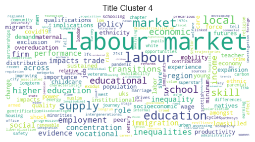

# Digitial Economy Act accredited projects analysis 2019-2025

## Executive summary
Understanding how researchers are using linked administrative data is essential for shaping effective investment, planning for future demand, and maintaining public trust. As interest in data-driven policymaking grows, so too does the need to assess whether existing data infrastructure is delivering value, enabling timely research, and adapting to evolving societal priorities. This analysis examines project-level usage patterns across the DEA-accredited research landscape to inform funders, policymakers, and the public about how sensitive data is being used for research in the public interest.

Key findings:
- Over 1000 projects have been approved under the DEA between 2019 and 14 May 2025
- Usage of ADR England flagship datasets grew by 345% (2021-2024) - effectively doubling every 1.4 years - with a log-linear model confirming an exponential growth trend (R² = 0.65, p = < 0.0001). Current growth trajectories suggest annual requests for ADR England flagship datasets could reach over 1,000 requests in 2029, with a 95% confidence interval ranging from 700 to ~3,000.
- The Longitudinal Education Outcomes (LEO) and Data First criminal justice collections drive 59% of flagship dataset demand, with Education and Child Health Insights from Linked Data (ECHILD) showing the fastest recent growth in demand (23 access requests since it was made available in Q3 2024). 
- Terms relating to health and education in project titles have more than tripled in prevalence, reflecting shifting research priorities.
- COVID-19 research terms surged to 13.5% of projects during the pandemic before declining to 2.7%, demonstrating system agility to evolving priorities.

This analysis provides evidence for funders on investment impact, offers early intelligence on emerging research themes, and enhances public transparency about how administrative data is being used in research for the public good.

## Strategic context
The UK government has positioned high-quality data as critical national infrastructure, investing over £100 million in the ADR UK program alone since 2018. This infrastructure enables unprecedented access to linked administrative datasets for public benefit research, supporting evidence-based approaches to complex challenges like productivity gaps and health inequalities.

Understanding the impact of this investment serves three strategic purposes:

1. Accountability: Demonstrating value to funders and the public whose data is being used
2. Intelligence: Identifying emerging research priorities and policy challenges
3. Planning: Ensuring infrastructure capacity meets growing researcher demand

Public funders need evidence that national datasets deliver research impact that justifies their development and maintenance costs, and help identify where future resources should be concentrated to support their use. Simultaneously, tracking the evolution of research themes provides early intelligence on emerging policy challenges and scientific opportunities, ensuring infrastructure keeps pace with researcher demand. With research access requests under the DEA steadily increasing (and likely to accelerate in future, given growth in the availability of valuable large-scale linked administrative data that programmes like ADR UK are driving forward), understanding demand trajectories is critical for capacity planning. This includes planning for project approval and capacity in the secure environments that support data access, so that infrastructure does not become a bottleneck to the very research it was designed to support.

## Research questions
This analysis addresses three fundamental questions about UK data infrastructure:
1. What is the scale and growth of data use?
- Quantifying DEA-approved projects since the public register began (Q4 2019)
- Measuring demand patterns across different datasets
- Tracking uptake of ADR England flagship datasets specifically

2. How are research priorities evolving?
- Identifying dominant research themes through text analysis
- Tracking emerging and declining topics over time
- Understanding alignment with policy challenges

3. What does this mean for future planning?
- Projecting future demand scenarios
- Identifying high-priority datasets for investment
- Informing infrastructure and approval process design given the rising demand

## Methods
**Data Collection**: Web-scraped the complete public register of DEA-accredited projects from the UK Statistics Authority website, excluding projects under alternative legal gateways (SRSA 2007) to focus on DEA-specific research.

**Dataset Analysis**: Categorized and grouped linked datasets into their flagship dataset collections (e.g., "Data First" for criminal justice data). Calculated quarterly and annual growth rates and compared linear, log-linear, and Poisson models for growth projections, selecting log-linear based on best fit metrics (AIC/BIC).

**Text Analysis**: Applied natural language processing to project titles, using TF-IDF (Term Frequency-Inverse Document Frequency) to identify distinctive research themes by year. Performed k-means clustering to group projects into thematic areas.

*(All code available on [github](https://github.com/balintstewart77/ADR_DEA_project)), main project notebook [here](https://github.com/balintstewart77/ADR_DEA_project/blob/main/analysis/DEA_projects_analysis.ipynb)*

## Summary of findings
**Overall Dataset Popularity**
- Over 1000 projects have been approved under the DEA between 2019 and 14 May 2025.
- The Business Structure Database (220 requests), Annual Business Survey (191 requests) and the Annual Survey of Hours and Earnings (158) are the three most frequently requested datasets across all of these projects.

**ADR England Flagship Datasets**
- The number of requests for ADR England flagship datasets **more than quadrupled** from 20 approved requests in 2021 to 89 requests in 2024 (growth rate of 345%) (Figure 3). Growth in access requests has been itself accelerating, with year-on-year growth rate increases of +40% (2021 -> 2022), +57% (2022 -> 2023), and 102% (2023 -> 2024). 
- This equates to a **doubling in the use of flagship datasets around every 1.4 years** on average over the observed annual time period.
- A log-linear model confirms an exponential growth trend (R² = 0.65, p = < 0.0001). Current growth trajectories suggest annual requests for ADR England flagship datasets could reach over 1,000 requests in 2029, with a 95% confidence interval ranging from ~300 to 4,000.

The Longitudinal Education Outcomes (LEO) (37% of all ADR England flagship dataset access requests) and Data First collections (22% of all ADR England flagship dattaset access requests, although this count doesn't include the popular MoJ-DfE linkage dataset which is not accessed through the DEA) are the most accessed flagship datasets overall. ECHILD shows the most rapid growth in use among flagship datasets, with a total of 23 access requests in just the three quarters it's been available.

**Research Theme Clusters**
Analysis of project title distinctiveness by year reveals that DEA-accredited research over the past six years broadly speaking falls into four distinct thematic clusters:

- Cluster 1: Business, growth, and productivity
- Cluster 2: Gender and ethnic inequalities and gaps
- Cluster 3: Health, social care, and children
- Cluster 4: Labour market, skills, and education

**Evolving Research Priorities**
Tracking term frequency over time reveals three distinct patterns in research focus:
- Stable research areas maintain consistent presence, with terms like 'labour', 'market', 'employment', and 'productivity' appearing at steady rates across all years, indicating sustained policy interest in economic research.
- Growing research areas show dramatic expansion, particularly health and education topics. The term 'health' has more than tripled from appearing in 3.8% of project titles in 2021 to 12% in 2025, while 'education' has quadrupled from 3.4% in 2020 to 14% in 2025. 
- Research areas showing both growth and decline demonstrate the system's responsiveness to changing priorities. COVID-19 research peaked at 13.5% of all project titles during the pandemic but has since declined sharply to just 2.7% in 2024, showing how the research ecosystem rapidly adapts as policy priorities evolve.

## Strategic Implications 

**Investment Returns and Future Demand**:
The 345% growth in flagship dataset usage over the observed time period demonstrates exceptional return on public investment, but may also signal upcoming capacity pressures. Although projects using ADR England flasghip datasets have historically represented a small fraction of overall projects approved through the DEA, if current trends continue, ADR UK and the ONS Secure Research Service can expect many more access requests for ADR England flagship datasets in future - in the absence of the emergence of other limitations (e.g. research funding, trained researcher capacity etc.) potentially rising to a 50-fold increase in demand in 2029 from 2021 baseline levels. This explosive growth is likely to considerably increase future demand on the ONS SRS, requiring proactive infrastructure scaling to prevent approval bottlenecks that could constrain high-value research. 

**Resource Allocation Priorities**
LEO and Data First collections account for 59% of all flagship access requests, suggesting opportunities for further investment and enhancement of these datasets with new linkages, training, metadata enhancement etc. Conversely, datasets with much fewer requests (e.g. GRADE, AD|ARC) may warrant review for useability and utility or targeted promotion to increase use. The shift toward health and education research themes, indicates growing demand for linked administrative data in these sectors.

**Policy Research Readiness**
The rapid emergence and decline of COVID-19 research (from 13.5% to 2.7% of project titles in just 2 years) demonstrates the system's ability to respond to urgent policy needs. However, maintaining this agility at a much greater scale will require streamlined approval processes and enhanced secure environment capacity.

## Data scope and quality
**Coverage**
- Analysis includes all DEA-approved projects from Q4 2019 through May 2025
- Analysis on future demand focuses on ADR England flagship datasets

**Known limitations**
- MoJ-DfE linked dataset excluded from Data First counts (different legal gateway)
- Geographic identifiers removed during standardization
- Project titles may not fully represent research content

These limitations and more are addressed in detail in the final section of this report.

## Analysis of all projects and datasets accessed through the DEA
- Over 1000 projects have been approved under the DEA between 2019 and 2025, applying for access to use an overall total of >2800 dataset instances.

### Figure 1: New DEA accredited projects by year
Note that 2019 data only includes Q4, and 2025 data is only Q1 and partial Q2 (to mid-May 2025)

    

    

### Figure 2: Top 25 datasets accessed under the DEA between end 2019 - mid May 2025
| Rank | Dataset | # Count |
|------|---------|---------|
| 1 | Business Structure Database | 220 |
| 2 | Annual Business Survey | 191 |
| 3 | Annual Survey of Hours and Earnings | 158 |
| 4 | Labour Force Survey | 151 |
| 5 | Annual Population Survey | 132 |
| 6 | Annual Respondents Database | 98 |
| 7 | Longitudinal Education Outcomes | 82 |
| 8 | UK Innovation Survey | 67 |
| 9 | Business Enterprise Research and Development | 54 |
| 10 | Understanding Society | 54 |
| 11 | Labour Force Survey Longitudinal | 37 |
| 12 | Business Register Employment Survey | 33 |
| 13 | Crime Survey for England and Wales | 31 |
| 14 | International Trade in Services | 29 |
| 15 | Labour Force Survey Household | 29 |
| 16 | Annual Survey of Hours and Earnings Longitudinal | 29 |
| 17 | Longitudinal Small Business Survey | 28 |
| 18 | ONS Longitudinal Study | 27 |
| 19 | Living Costs and Food Survey | 27 |
| 20 | Education and Child Health Insights from Linked Data | 25 |
| 21 | Growing Up in England | 23 |
| 22 | Wealth and Assets Survey | 21 |
| 23 | Data First: Crown Court Dataset | 20 |
| 24 | Longitudinal Study of England and Wales | 19 |
| 25 | Business Insights and Conditions Survey | 19 |

## Analysis of ADR UK flagship dataset demand

- Since Q1 2021 to end of Q1 2025, there have been 174 projects requesting access to a total of 218 ADR UK flagship datasets

### Figure 3: Growth in overall ADR England flagship data requests 
This figure shows the number of research projects accessing ADR UK flagship datasets over time, aggregated by year (left) and quarter (right). The bar chart on the left indicates annual totals, with a marked increase in 2024. The 2025 value reflects only Q1 data (as noted by the asterisk). The right-hand chart provides a more granular quarterly view, revealing a clear upward trend beginning in early 2023 and accelerating through 2024 and Q1 2025. The data illustrate rising research interest and engagement with ADR England flagship datasets.

    

    

### Figure 4: Growth Metrics for ADR UK Flagship Dataset Access (2021–2024)
This figure summarises the rising demand for ADR England flagship datasets through three related tables:

- The Annual Performance Summary table (top) shows yearly totals, average projects per quarter, standard deviation, and coefficient of variation (CV). Notably, dataset access more than quadrupled from 2021 to 2024, with a +102.3% year-over-year increase in 2024 alone. The falling CV from 2021 to 2023 indicates increasingly stable quarterly uptake.
- The Quarterly Breakdown (middle) provides granular counts per quarter. This reveals surges in late 2023 and sustained growth across all quarters of 2024.
- The Key Growth Metrics table (bottom) quantifies the overall trend: a Compound Annual Growth Rate (CAGR) of 64.5% from 2021 to 2024 and 345% total growth over that period.

#### Annual Performance Summary

| Year | Annual Total | Avg per Quarter | Quarterly Std Dev | CV | Year-over-Year Growth |
|------|--------------|-----------------|-------------------|----|-----------:|
| 2021 | 20 | 5.0 | 4.2 | 0.840 | — |
| 2022 | 28 | 7.0 | 3.5 | 0.500 | +40.0% |
| 2023 | 44 | 11.0 | 2.9 | 0.264 | +57.1% |
| 2024 | 89 | 22.2 | 8.5 | 0.383 | +102.3% |

#### Quarterly Breakdown

| Year | Q1 | Q2 | Q3 | Q4 | Annual Total |
|------|----|----|----|----|-------------:|
| 2021 | 2 | 10 | 1 | 7 | 20 |
| 2022 | 10 | 10 | 4 | 4 | 28 |
| 2023 | 13 | 8 | 9 | 14 | 44 |
| 2024 | 11 | 21 | 26 | 31 | 89 |

#### Key Growth Metrics

| Metric | Value |
|--------|------:|
| **Compound Annual Growth Rate (2021-2024)** | **64.5%** |
| Total Growth | 345.0% |
| Average Annual Requests | 45 |

**Notes:**
- CV = Coefficient of Variation (volatility measure). Lower CV indicates more consistent quarterly performance

### Figure 5: Model comparison of forecasting approaches for ADR England flagship access requests
This table compares three fitted models—linear, log-linear (exponential growth), and Poisson—based on R-squared, Akaike Information Criterion (AIC), Bayesian Information Criterion (BIC), and the significance of the time trend (Quarter Index). The log-linear model yields the lowest AIC and BIC, indicating the best trade-off between fit and complexity. 

| Model       | R-squared | AIC       | BIC        | P-value (Index) |
|-------------|-----------|-----------|------------|-----------------|
| Linear      | 0.6733    | 111.1962  | 112.8627   | 5.46e-05        |
| Log-linear  | 0.6497    | 25.5410   | 27.2075    | 9.35e-05        |
| Poisson     | —         | 103.3669  | -12.4258   | 3.61e-19        |

### Figure 6: Forecast of ADR England Flagship Access Requests 
The line marked with circles shows observed quarterly access request counts from 2021 onwards. The dashed black line represents model predictions from a log-linear regression model fitted to historical data. The orange dashed line and x-marks indicate forecasted access requests for eight quarters beyond the most recent observation. The shaded region denotes the 95% confidence interval for the forecast, and the vertical red dotted line marks the point at which the forecast period begins.

    

    

## Breakdowns by individual ADR UK flagship datatset collections

**Datasets included in WED collection**:
- Annual Survey of Hours and Earnings Longitudinal
- Annual Survey of Hours and Earnings Linked to Census 2011  
- Annual Survey of Hours and Earnings Linked to PAYE and Self-Assessment Data  

**Datasets included in Data First collection**:
- Data First: Crown Court Dataset  
- Data First: Cross-Justice System Linking Dataset  
- Data First: Prisoner Dataset  
- Data First: Probation Dataset  
- Data First: Family Court Dataset  
- Data First: Magistrates Court Dataset  
- *Note: MoJ-DfE linkage is not included in this analysis as it is accessed via a different legal gateway and is not listed in the public register*

### Figure 7: Summary results table for individual collections
This figure presents a comparative summary of individual ADR England flagship collections based on access volume and growth dynamics:
The summary table ranks collections by total requests, average quarterly activity, variation in demand (coefficient of variation), growth rate, and number of active quarters.
- LEO leads in total requests (80) and shows strong and consistent growth.
- ECHILD, although recently introduced, shows the highest average access per quarter (7.7) and the most rapid growth (+460%), though this may be artificially inflated due to the short baseline.
- GRADE and Wage and Employment Dynamics display more stable or declining trends.

| Collection                       | Total | Avg Requests per Active Quarter | Coefficient of Variation | # Active Quarters |
|----------------------------------|-------|---------------------------------|--------------------------|-------------------|
| LEO                              | 80    | 5.0                             | 0.97                     | 16                |
| Data First                       | 49    | 3.1                             | 1.13                     | 16                |
| Wage and Employment Dynamics     | 31    | 1.8                             | 0.65                     | 17                |
| ECHILD                           | 23    | 7.7                             | 0.76                     | 3                 |
| Growing up in England            | 21    | 1.5                             | 1.19                     | 14                |
| GRADE                            | 10    | 3.3                             | 0.62                     | 3                 |
| Agricultural Research Collection | 4     | 0.4                             | 1.85                     | 11                |

### Figure 8: Graphs showing total volume and average quarterly requests for each ADR England flagship dataset collection 
This dual horizontal bar chart compares access volume and intensity across individual ADR England flagship collections:
The left panel shows total requests per dataset.
- LEO is the most accessed dataset (80 requests), followed by Data First (49) and Wage and Employment Dynamics (31).
- ECHILD, despite being a newer entry, has already received 23 requests, surpassing some longer-established datasets.

The right panel presents average requests per quarter, a measure of sustained demand intensity.
- ECHILD leads with ~7.7 average requests per quarter, reflecting rapid uptake over a short period.
- LEO (5.0) also shows strong quarterly engagement.

    

    

### Figure 9: Quarterly trends for ADR England flagship datasets split by collection
This faceted line plot shows quarterly access patterns for each of the ADR England flagship datasets from Q1 2021 to Q1 2025. Each subplot represents a single dataset, with the vertical axis indicating the number of projects accessing that dataset per quarter:
- LEO and Data First exhibit sustained and growing usage, with LEO peaking in late 2024.
- ECHILD shows a steep rise following its recent introduction in Q3 2024, reflecting rapid uptake (though caution is advised interpreting long-term significance).
- GRADE and the Agricultural Research Collection show limited and irregular engagement, with GRADE use dropping after Q3 2024.
- Wage and Employment Dynamics and Growing up in England demonstrate modest but consistent interest over time.

    

    

# Part 2: How have research topics and priorities evolved over time?

## Analysis of all DEA approved projects

### Figure 10: Thematic clusters of DEA research project titles
This figure presents word clouds for four thematic clusters (Title clusters 1-4) identified through K-means clustering of DEA research project titles. Project titles were vectorized using TF-IDF, then clustered to group titles with similar thematic content. Word size in each cloud reflects the term's frequency and prominence within that specific cluster

    

    

    

    

    

    

    

    

- Distinctive research terms across all DEA accredited project titles over the past 6 years can be split very broadly into four clusters:
    - Cluster 1: project titles on business, growth, and productivity; 
    - Cluster 2: gender and ethnic inequalities and gaps, 
    - Cluster 3: includes terms on health, social and children;
    - Cluster 4: labour market, skills and education terms.

### Figure 11: Individual term trends for top 10 terms by year
Graphs track annual TF-IDF scores for ten most prominent research terms: labour, market, covid19, productivity, social, education, business, health, local, inequalities; in project titles from the public register between 2020 and 2024. TF-IDF (Term Frequency–Inverse Document Frequency) reflects how important a term is in a specific year relative to other years, highlighting changes in salience over time. An upward trend indicates growing distinctiveness or emphasis of a term in that year's projects, while a decline suggests decreasing thematic prominence. Each panel shows the term’s yearly score, helping identify evolving research interests within the DEA-accredited landscape.

    

    

### Figure 12: Term usage trends in DEA Projects: Percentage of project titles mentioning top 10 terms
This figure shows the proportion of DEA-accredited research projects each year (2020–2024) that mention selected key terms in their titles. Each subplot tracks a different term from the top 10 most frequent across the dataset, highlighting the share of projects in which that term appears. Unlike TF-IDF, this metric reflects raw occurrence rates (% of total projects) and provides a straightforward view of term popularity over time. For example, covid19 peaked in 2021 and declined thereafter, while education and health steadily gained prominence. This helps communicate a more-easily understandable metric than TF-IDF scores.

    

    

# Future possible directions

## Part 1: Dataset access trends
**Methodological improvements**:
- Incorporate flagship datasets from ADR UK partners in the devolved administrations
- Incorporate the popular MoJ-DfE linkage dataset into the Data First collection counts
- Analyse growth in projects using ADR England flagship datasets rather than simply number of requests for flagship datasets within those projects (there will always be slightly fewer projects than access requests because a single project will sometimes request more than one flagship dataset, and capacity pressure for approvals and secure environment usage arises from projects, rather than datasets)

**Additional questions**:
- Look at flagship dataset investment level to better understand the value for money in supporting different linkages in terms of their demand
- Develop the impact measurement with the addition of known research outputs (publications, policy briefs etc.) linked to approved project data
- User segmentation: what kind of research organisations (universities, government, third sector) are using these data? Understanding institutional patterns could inform targeted outreach and capacity building efforts
- Are there centres of research activity using particular datasets that could serve as hubs for training and best practice sharing?

**Other potential developments**:
- Improve the transparency and accessibility of the public register, providing a fully searchable and filterable web-based dataset for the public to better understand the research that is being undertaken using their data
- Produce a web-based dashboard live-fed with data from the register to allow for automatically updated and easy-to-interpret visualisations of dataset use and research themes
- Develop public engagement tools that allow individuals to understand how their data contributes to research (noting that direct personal data matching would require careful consideration of privacy and security implications)

## Part 2: Topic trends in research
**Methodological improvements**:
- N-gram analysis to find commonly co-occurring terms for a richer thematic analysis
- Clustering analysis using more advanced computational approaches (such as density-based spatial clustering) to improve cluster separation and identify research themes more precisely
- Dynamic topic modelling using established frameworks for more detailed analysis of how research themes evolve over time

**Additional questions**:
- How do topic trends align with stated government priorities and policy agendas? This analysis could help identify research gaps or areas where policy interest exceeds current research activity
- What factors drive the emergence of new research themes, and how quickly does the research ecosystem respond to policy priorities?

**Other potential developments**:
- Produce a recommendation system for researchers, suggesting relevant datasets based on their research questions and helping to optimise dataset use across the research community

# Some limitations in this work
## Data collection and coverage limitations
- The public register only begins in Q4 2019, so early DEA usage and adoption trends since 2017 are not captured
- The public register only includes approved projects. We have no visibility into rejected applications, abandoned projects, or researchers discouraged by perceived barriers who never apply
- The focus on ADR England flagship datasets excludes those from Scotland, Wales, and Northern Ireland, limiting UK-wide insights
- The MoJ-DfE linked dataset is omitted from Data First collection counts as it is not accessed via the DEA, potentially understating demand for justice-education data
- Web scraping introduces risks of missed entries or parsing errors due to formatting changes which are not always easy to detect

## Technical and methodological constraints
- Growth projection assumptions: exponential forecasts assume continued trends, but are likely to become limited by other factors (funding, researcher capacity, processing delays, policy shifts, or demand saturation)
- Title-based topic analysis limitations: project titles may misrepresent research content, leading to misclassification, especially for generic or interdisciplinary studies
- Classification subjectivity: dataset grouping and thematic clustering involved subjective choices that may influence interpretation of trends
- Simple modeling approach: exponential models do not account for seasonality, structural breaks, capacity limits, or network effects across datasets
- TF-IDF limitations: Lacks ability to detect semantic similarity or shifts in term meaning over time; more advanced NLP methods could yield different insights

These limitations suggest findings should be treated as indicative rather than definitive.
